# Practica-DNS-Edmundo
## Objectiu

Implementar una infraestructura DNS redundant amb servidor Master i Slave en entorns Linux i Windows.

## Tecnologies
Ubuntu Server
Windows Server
BIND9
nslookup
## Configuració Linux
### CS01 — named.conf.local

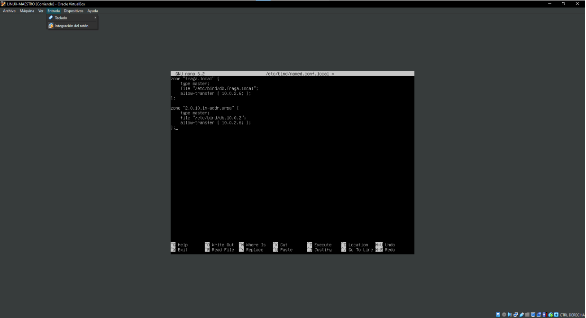

### CS02 — zona directa

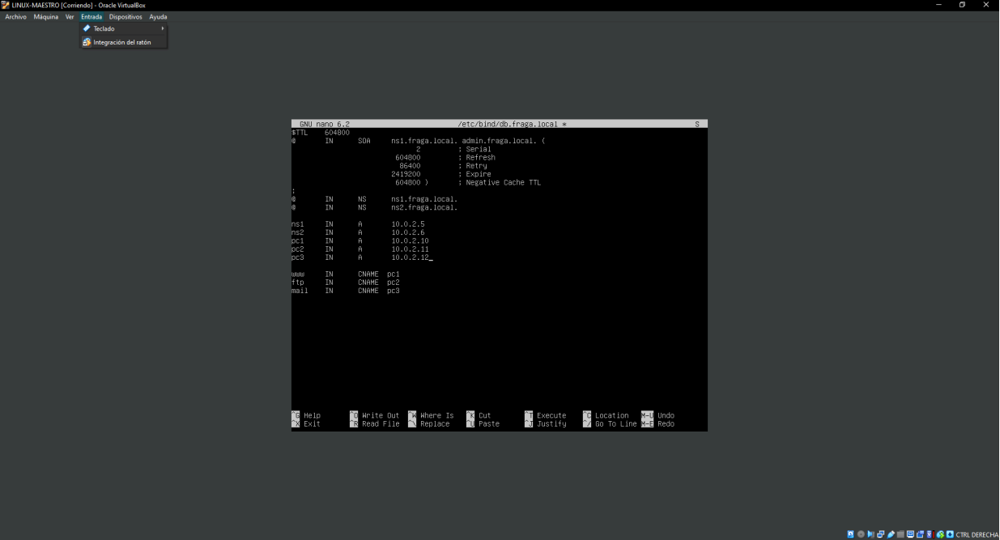

### CS03 — zona inversa

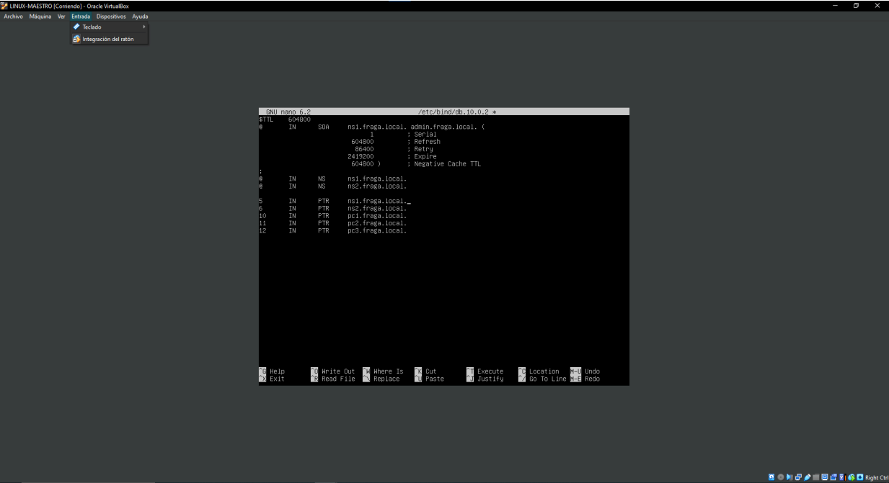

### CS04 — named.conf.local slave

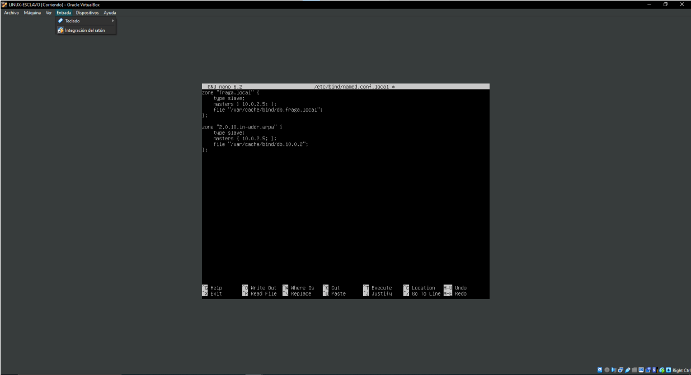

## Validació Linux
### CS05 — nslookup DNS master

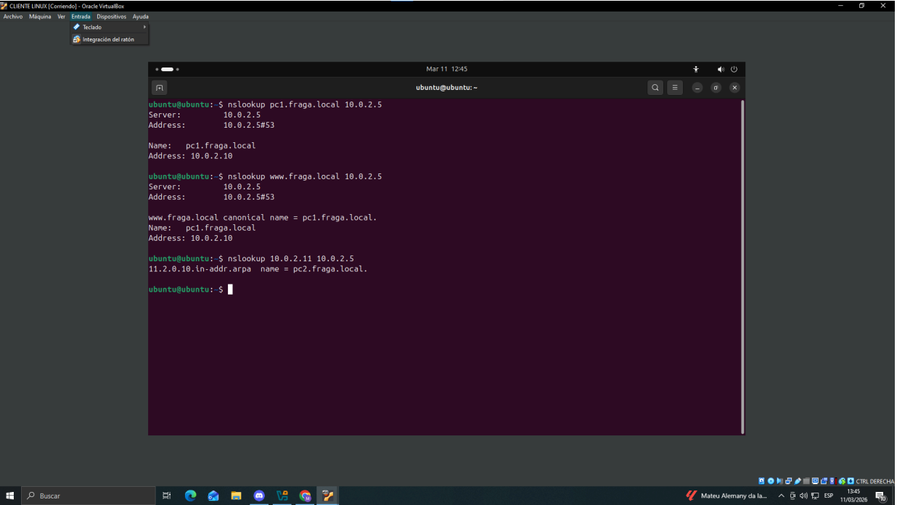

### CS06 — nslookup DNS slave

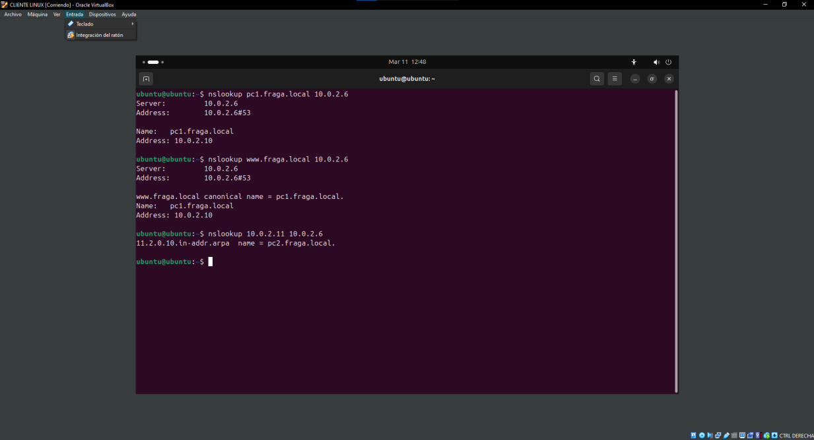

## Configuració Windows
### CS07 — zones configurades

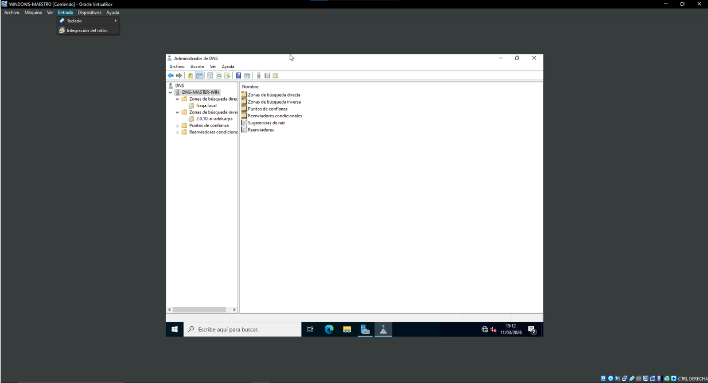

### CS08 — zona directa

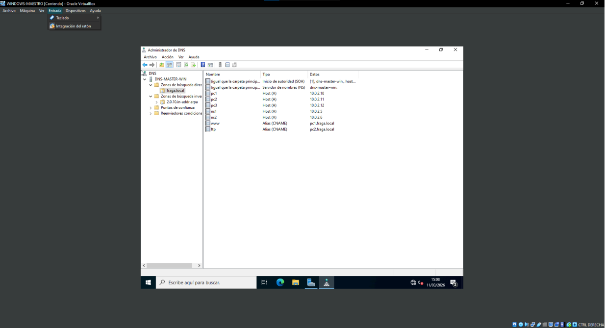

### CS09 — zona inversa

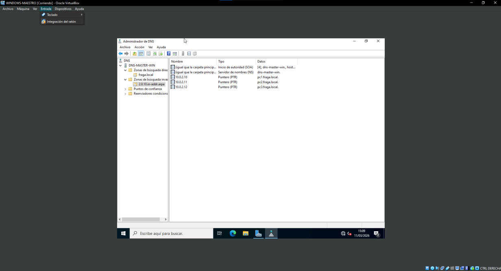

### CS10 — zones DNS slave

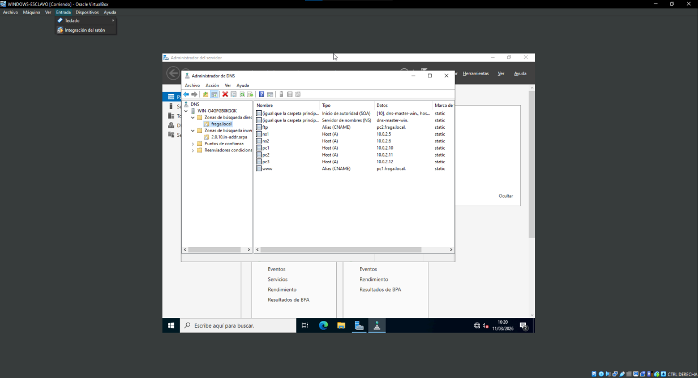

## Validació Windows
### CS11 — nslookup master

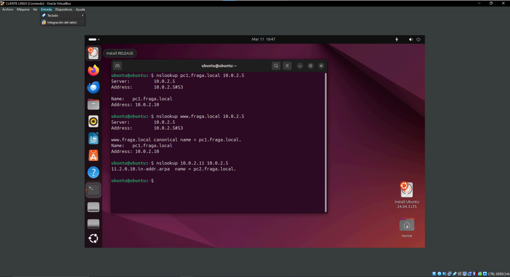

### CS12 — nslookup slave

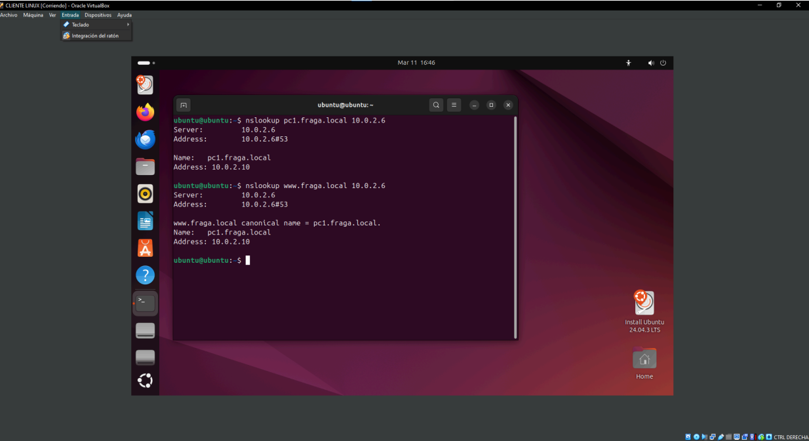
